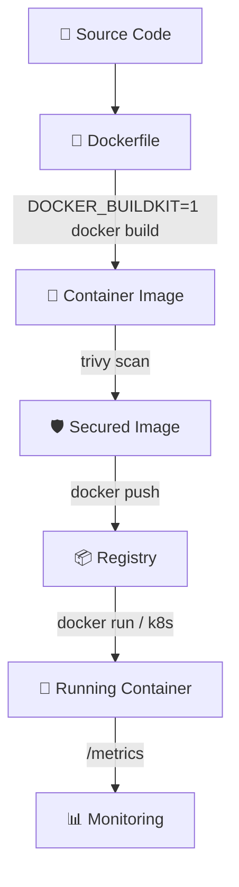

# 🐳 Docker Manager
> **Containerize workloads correctly. Build clean production-grade Dockerfiles with validation checks and automated configuration maps.**

[](https://pradeeptalari14.github.io/portfolio/tools/docker/)
[]()

---

## 🎛️ Studio Options — What the UI Generates

The studio has multiple configurable options. Each combination produces different output files.
This repository contains **one working example per option variant** so you can learn by diffing.

### Output Tabs (files the studio generates)
| Tab | Description |
|-----|-------------|
| `Dockerfile` | Generated in studio Output tab |
| `docker-compose.yml` | Generated in studio Output tab |
| `.dockerignore` | Generated in studio Output tab |
| `entrypoint.sh` | Generated in studio Output tab |
| `trivy.yaml` | Generated in studio Output tab |
| `Flow Diagram` | Generated in studio Output tab |

### Configurable Options
| Option | Available Values |
|--------|-----------------|
| **Base Image** | `node:20-alpine` / `python:3.11-slim` / `golang:1.22-alpine` / `openjdk:21-slim` |
| **Multi-stage Build** | `enabled` / `disabled` |
| **Non-root User** | `enabled` / `disabled` |
| **Mount Cache** | `enabled` / `disabled` |

---

## 🏗️ Architecture Flow Diagram



---

## 📁 Repository Structure

```
tp-docker/
├── README.md          ← This file — complete learning guide
├── examples/node-multistage/Dockerfile
├── examples/python-singlestage/Dockerfile
├── examples/golang/Dockerfile
├── examples/java/Dockerfile
├── docker-compose.yml
├── .dockerignore
├── entrypoint.sh
├── trivy.yaml
├── scripts/           ← Deployment + validation helpers
└── docs/USAGE.md      ← Extended usage guide
```

---

## ⚡ Quick Start

### Step 1 — Generate files from the Studio
1. Open **[Docker Manager Studio](https://pradeeptalari14.github.io/portfolio/tools/docker/)**
2. Select your option values in the UI
3. Watch the output update live in the editor
4. Click **Download** or **Copy** for each tab

### Step 2 — Use the example files in this repo
```bash
git clone https://github.com/Pradeeptalari14/tp-docker.git
cd tp-docker
# Browse examples/ to find the variant matching your needs
# Copy the relevant files into your project
```

---

## 🔄 Complete Start-to-End Workflow


---

## 📖 How Each Option Changes the Output

### Base Image
- **`node:20-alpine`** — see `examples/` folder for generated output
- **`python:3.11-slim`** — see `examples/` folder for generated output
- **`golang:1.22-alpine`** — see `examples/` folder for generated output
- **`openjdk:21-slim`** — see `examples/` folder for generated output

### Multi-stage Build
- **`enabled`** — see `examples/` folder for generated output
- **`disabled`** — see `examples/` folder for generated output

### Non-root User
- **`enabled`** — see `examples/` folder for generated output
- **`disabled`** — see `examples/` folder for generated output

### Mount Cache
- **`enabled`** — see `examples/` folder for generated output
- **`disabled`** — see `examples/` folder for generated output

---

## 🔐 Security Best Practices

- ❌ Never commit credentials, API keys, or passwords
- ✅ Use environment variables or secret managers (Vault, AWS SSM, GitHub Secrets)
- ✅ Enable branch protection: require PR reviews + CI status checks
- ✅ Rotate credentials regularly and use least-privilege

---

## 📖 Resources

| Resource | Link |
|----------|------|
| Interactive Studio | [Open →](https://pradeeptalari14.github.io/portfolio/tools/docker/) |
| All 91 Studios | [Dashboard →](https://pradeeptalari14.github.io/portfolio/tools/) |
| SRE Provisioning Guide | [Handbook →](https://github.com/Pradeeptalari14/portfolio/blob/main/GITHUB_PROVISIONING_GUIDE.md) |

---
*Generated by [Docker Manager Studio](https://pradeeptalari14.github.io/portfolio/tools/docker/) — [Talari Pradeep Portfolio](https://pradeeptalari14.github.io/portfolio)*